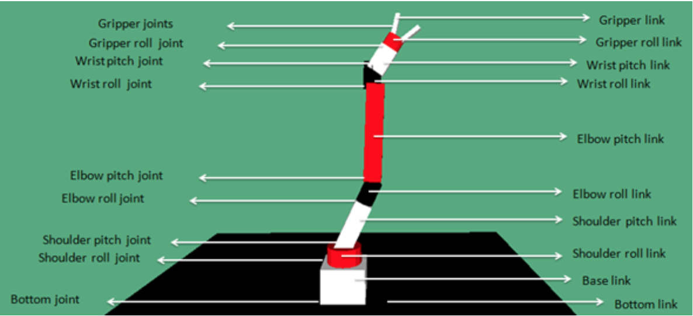

# RoboticArm


To replicate our work you need to follow the next sections. To use it directly go INSERT LINK

## Technical requirements
- Ubuntu 20.04
- ROS Noetic

## 1. Robot description
### 1.1 Create the ROS package for the robot description
```bash
cd catkin_ws/src
```

```bash
catkin_create_pkg project_robot_description roscpp tfgeometry_msgs urdf rviz xacro
```

```bash
sudo apt-get install ros-noetic-urdf
```

```bash
sudo apt-get install ros-noetic-xacro
```


Next, download all available folders in the repository. We will use the robot model.

```bash
git clone https://github.com/PacktPublishing/Mastering-ROS-for-Robotics-Programming-Third-edition.git
```

From the folder ``Chapter3/mastering_ros_robot_description_pkg`` copy all files to ``catkin_ws/src/project_robot_description``.


In this project we will use a seven-DOF robotic arm, showed in the next picture.

<p align="center"></p>

### 1.2 Attach an RGB camera
To do that you need to modify the file ``project_robot_description/urdf/seven_dof_arm.xacro`` adding the following code. The first elements of this block are an extra link and joint added to the URDF file that represents the camera.
```XML
<link name="camera_link">
      <collision>
        <origin xyz="0 0 0" rpy="0 0 0"/>
        <geometry>
          <box size="${cameraSize} ${cameraSize} ${cameraSize}"/>
        </geometry>
      </collision>

      <visual>
        <origin xyz="0 0 0" rpy="0 0 0"/>
        <geometry>
          <box size="${cameraSize} ${cameraSize} ${cameraSize}"/>
        </geometry>
        <material name="green"/>
      </visual>

      <inertial>
        <mass value="${cameraMass}" />
        <origin xyz="0 0 0" rpy="0 0 0"/>
        <box_inertia m="${cameraMass}" x="${cameraSize}" y="${cameraSize}" z="${cameraSize}" />
        <inertia ixx="1e-6" ixy="0" ixz="0" iyy="1e-6" iyz="0" izz="1e-6" />
      </inertial>
    </link>

    <joint name="camera_joint" type="fixed">
      <axis xyz="0 1 0" />
      <origin xyz=".2 0 0" rpy="0 0 0"/>
      <parent link="base_link"/>
      <child link="camera_link"/>
    </joint>

```
You need also to define these XACRO properties.
```XML
<!--Camera-->
<xacro:property name="cameraSize" value="0.05"/>
<xacro:property name="cameraMass" value="0.1"/>
```

After, create the file ``seven_dof_arm.gazebo`` in the folder ``project_robot_description/urdf`` inserting the following code. With this code we can use the Gazebo plugin that gives us the camera functionality and publishes the image to a ROS message.

```XML
<?xml version="1.0"?>
<robot>
 <gazebo reference="camera_link">
    <material>Gazebo/Green</material>
    <sensor type="camera" name="camera">
      <update_rate>30.0</update_rate>
      <visualize></visualize>
      <camera name="head">
        <horizontal_fov>1.3962634</horizontal_fov>
        <image>
          <width>800</width>
          <height>800</height>
          <format>R8G8B8</format>
        </image>
        <clip>
          <near>0.02</near>
          <far>300</far>
        </clip>
      </camera>
      <plugin name="camera_controller" filename="libgazebo_ros_camera.so">
        <alwaysOn>true</alwaysOn>
        <updateRate>0.0</updateRate>
        <cameraName>seven_dof_arm/camera</cameraName>
        <imageTopicName>image_raw</imageTopicName>
        <cameraInfoTopicName>camera_info</cameraInfoTopicName>
        <frameName>camera</frameName>
        <hackBaseline>0.07</hackBaseline>
        <distortionK1>0.0</distortionK1>
        <distortionK2>0.0</distortionK2>
        <distortionK3>0.0</distortionK3>
        <distortionT1>0.0</distortionT1>
        <distortionT2>0.0</distortionT2>
      </plugin>
    </sensor>
  </gazebo>

</robot>
```
And finally you need to include the file in the URDF model.
```XML
<xacro:include filename="$(find project_robot_description)/urdf/seven_dof_arm.gazebo"/>
```

To check if the camera has been added, you need to create the package to simulate the robotic arm.
```
catkin_create_pkg project_gazebo gazebo_msgs gazebo_plugins gazebo_ros gazebo_ros_control project_robot_description
```

And then you need to create the launch file ``project_gazebo/launch/seven_dof_arm_world.launch`` inserting the following code. With this file you can show the robotic arm in an empty world.


```XML
<?xml version="1.0" ?>

<launch>
  <!-- these are the arguments you can pass this launch file, for example paused:=true -->
  <arg name="paused" default="false"/>
  <arg name="use_sim_time" default="true"/>
  <arg name="gui" default="true"/>
  <arg name="headless" default="false"/>
  <arg name="debug" default="false"/>

  <!-- We resume the logic in empty_world.launch -->
  <include file="$(find gazebo_ros)/launch/empty_world.launch">
    <arg name="debug" value="$(arg debug)" />
    <arg name="gui" value="$(arg gui)" />
    <arg name="paused" value="$(arg paused)"/>
    <arg name="use_sim_time" value="$(arg use_sim_time)"/>
    <arg name="headless" value="$(arg headless)"/>
  </include>

  <!-- Load the URDF into the ROS Parameter Server -->
  <param name="robot_description" command="$(find xacro)/xacro '$(find project_robot_description)/urdf/seven_dof_arm.xacro'" />

  <!-- Run a python script to the send a service call to gazebo_ros to spawn a URDF robot -->
  <node name="urdf_spawner" pkg="gazebo_ros" type="spawn_model" respawn="false" output="screen"
	args="-urdf -model seven_dof_arm -param robot_description"/> 

</launch>
```

After, execute in the terminal the following commands to see the robot model in the empty world, to check if the topic to receive the images from camera has been created and finally to receive the stream of the camera.

```
roslaunch project_gazebo seven_dof_arm_world.launch
```
```
rostopic list
```
```
rosrun image_view image_view image:=/seven_dof_arm/camera/image_raw
```


## 2. Create the custom world for the robot
To create the world easily, respecting the proportions, it is best to start from an empty world with the robot inside. 

Run Gazebo with this command.
```
roslaunch project_gazebo seven_dof_arm_world.launch
```

And then insert all the objects that you want. Before saving the world you need to delete from the scene the robot model, and finally you can save the world as ``new_world.world`` in the folder ``project_gazebo/worlds``.

After you need to change the file ``project_gazebo/launch/seven_dof_arm_world.launch`` to show in Gazebo the new world.
```XML
<arg name="world" default="$(find project_gazebo)/worlds/new_world.world"/>
```

```XML
<arg name="world_name" value="$(arg world)" />
```

Execute again this command to check if everything works.
```
roslaunch project_gazebo seven_dof_arm_world.launch
```
