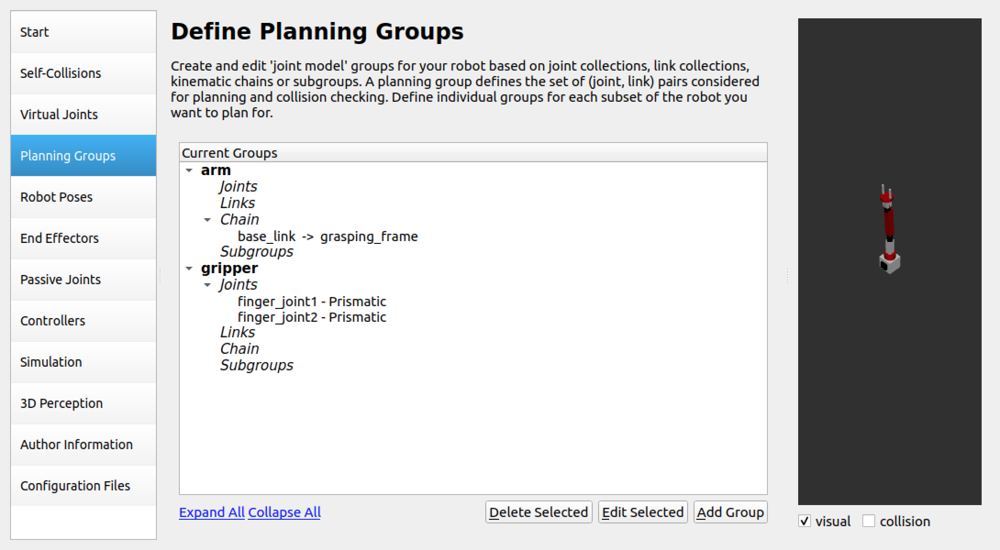
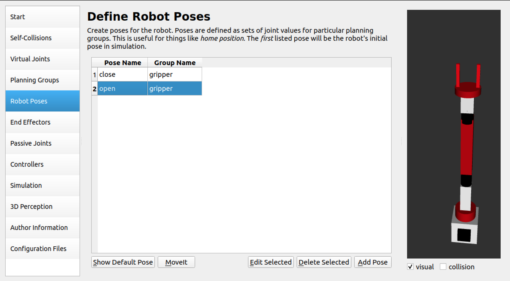
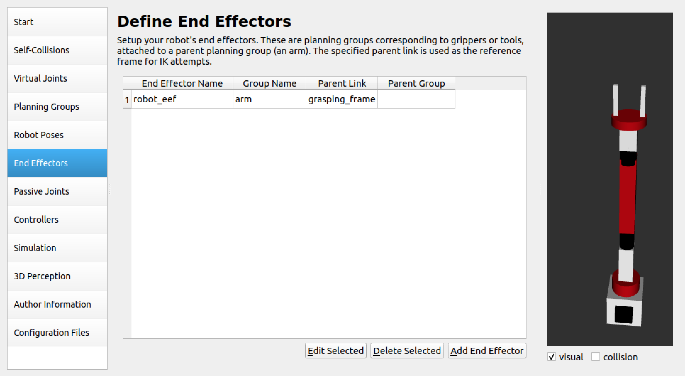

# RoboticArm
The aim of this project is to use a robotic arm to classify canned drinks and sort them into special boxes.

## Technical requirements
- Ubuntu 20.04
- ROS Noetic
- Python 3.8

## 1. Robot description
### 1.1 Create the ROS package for the robot description
```bash
cd catkin_ws/src
```

```bash
catkin_create_pkg project_robot_description roscpp tfgeometry_msgs urdf rviz xacro
```

```bash
sudo apt-get install ros-noetic-urdf
```

```bash
sudo apt-get install ros-noetic-xacro
```


Next, download all available folders in the repository. We will use the robot model.

```bash
git clone https://github.com/PacktPublishing/Mastering-ROS-for-Robotics-Programming-Third-edition.git
```

From the folder ``Chapter3/mastering_ros_robot_description_pkg`` copy all files to ``catkin_ws/src/project_robot_description``.


In this project we will use a seven-DOF robotic arm, showed in the next picture.

<p align="center"></p>

### 1.2 Attach an RGB camera
To do that you need to modify the file ``project_robot_description/urdf/seven_dof_arm.xacro`` adding the following code. The first elements of this block are an extra link and joint added to the URDF file that represents the camera.
```XML
<link name="camera_link">
      <collision>
        <origin xyz="0 0 0" rpy="0 0 0"/>
        <geometry>
          <box size="${cameraSize} ${cameraSize} ${cameraSize}"/>
        </geometry>
      </collision>

      <visual>
        <origin xyz="0 0 0" rpy="0 0 0"/>
        <geometry>
          <box size="${cameraSize} ${cameraSize} ${cameraSize}"/>
        </geometry>
        <material name="Black"/>
      </visual>

      <inertial>
        <mass value="${cameraMass}" />
        <origin xyz="0 0 0" rpy="0 0 0"/>
        <box_inertia m="${cameraMass}" x="${cameraSize}" y="${cameraSize}" z="${cameraSize}" />
        <inertia ixx="1e-6" ixy="0" ixz="0" iyy="1e-6" iyz="0" izz="1e-6" />
      </inertial>
    </link>

    <joint name="camera_joint" type="fixed">
      <axis xyz="0 1 0" />
      <origin xyz=".04 0 0" rpy="0 0 0"/>
      <parent link="base_link"/>
      <child link="camera_link"/>
    </joint>

```
You need also to define these XACRO properties.
```XML
<!--Camera-->
<xacro:property name="cameraSize" value="0.05"/>
<xacro:property name="cameraMass" value="0.1"/>
```

After, create the file ``seven_dof_arm.gazebo`` in the folder ``project_robot_description/urdf`` inserting the following code. With this code we can use the Gazebo plugin that gives us the camera functionality and publishes the image to a ROS message.

```XML
<?xml version="1.0"?>
<robot>
 <gazebo reference="camera_link">
    <material>Gazebo/Black</material>
    <sensor type="camera" name="camera">
      <update_rate>30.0</update_rate>
      <visualize></visualize>
      <camera name="head">
        <horizontal_fov>1.3962634</horizontal_fov>
        <image>
          <width>800</width>
          <height>800</height>
          <format>R8G8B8</format>
        </image>
        <clip>
          <near>0.02</near>
          <far>300</far>
        </clip>
      </camera>
      <plugin name="camera_controller" filename="libgazebo_ros_camera.so">
        <alwaysOn>true</alwaysOn>
        <updateRate>0.0</updateRate>
        <cameraName>seven_dof_arm/camera</cameraName>
        <imageTopicName>image_raw</imageTopicName>
        <cameraInfoTopicName>camera_info</cameraInfoTopicName>
        <frameName>camera</frameName>
        <hackBaseline>0.07</hackBaseline>
        <distortionK1>0.0</distortionK1>
        <distortionK2>0.0</distortionK2>
        <distortionK3>0.0</distortionK3>
        <distortionT1>0.0</distortionT1>
        <distortionT2>0.0</distortionT2>
      </plugin>
    </sensor>
  </gazebo>

</robot>
```
And finally you need to include the file in the URDF model.
```XML
<xacro:include filename="$(find project_robot_description)/urdf/seven_dof_arm.gazebo"/>
```

To check if the camera has been added, you need to create the package to simulate the robotic arm.
```
catkin_create_pkg project_gazebo gazebo_msgs gazebo_plugins gazebo_ros gazebo_ros_control project_robot_description
```

And then you need to create the launch file ``project_gazebo/launch/seven_dof_arm_world.launch`` inserting the following code. With this file you can show the robotic arm in an empty world.


```XML
<?xml version="1.0" ?>

<launch>
  <!-- these are the arguments you can pass this launch file, for example paused:=true -->
  <arg name="paused" default="false"/>
  <arg name="use_sim_time" default="true"/>
  <arg name="gui" default="true"/>
  <arg name="headless" default="false"/>
  <arg name="debug" default="false"/>

  <!-- We resume the logic in empty_world.launch -->
  <include file="$(find gazebo_ros)/launch/empty_world.launch">
    <arg name="debug" value="$(arg debug)" />
    <arg name="gui" value="$(arg gui)" />
    <arg name="paused" value="$(arg paused)"/>
    <arg name="use_sim_time" value="$(arg use_sim_time)"/>
    <arg name="headless" value="$(arg headless)"/>
  </include>

  <!-- Load the URDF into the ROS Parameter Server -->
  <param name="robot_description" command="$(find xacro)/xacro '$(find project_robot_description)/urdf/seven_dof_arm.xacro'" />

  <!-- Run a python script to the send a service call to gazebo_ros to spawn a URDF robot -->
  <node name="urdf_spawner" pkg="gazebo_ros" type="spawn_model" respawn="false" output="screen"
	args="-urdf -model seven_dof_arm -param robot_description"/> 

</launch>
```

After, execute in the terminal the following commands to see the robot model in the empty world, to check if the topic to receive the images from camera has been created and finally to receive the stream of the camera.

```
roslaunch project_gazebo seven_dof_arm_world.launch
```
```
rostopic list
```
```
rosrun image_view image_view image:=/seven_dof_arm/camera/image_raw
```

### 1.3 Fix gripper
Since the gripper in this model does not work because it passes through objects, we made the gripper fingers solid and then inserted a plugin for Gazebo to attach and detach objects (This is because the physics engine is not optimized for grasping yet.).

To make the gripper fingers solid we inserted collisions using the following code.
```XML
 <link name="gripper_finger_link1">
     <visual>
      <origin xyz="0.04 -0.03 0"/>
      <geometry>
           <box size="${left_gripper_len} ${left_gripper_width} ${left_gripper_height}" />
      </geometry>
      <material name="White" />
    </visual>
    <collision>
      <origin xyz="0.04 -0.03 0"/>
      <geometry>
        <box size="${left_gripper_len} ${left_gripper_width} ${left_gripper_height}" />
      </geometry>
    </collision>
	<xacro:inertial_matrix mass="1"/>
  </link>

```

```XML
  <link name="gripper_finger_link2">
    <visual>
      <origin xyz="0.04 0.03 0"/>
      <geometry>
      	<box size="${right_gripper_len} ${right_gripper_width} ${right_gripper_height}" />
      </geometry>
      <material name="White" />
    </visual>
    <collision>
      <origin xyz="0.04 0.03 0"/>
      <geometry>
        <box size="${right_gripper_len} ${right_gripper_width} ${right_gripper_height}" />
      </geometry>
    </collision>
	<xacro:inertial_matrix mass="1"/>
  </link>
```

As a plugin to use the gripper in the gazebo we used [gazebo_grasp_plugin](https://github.com/JenniferBuehler/gazebo-pkgs) . To use it you need the following commands.
```
sudo apt-get install ros-noetic-gazebo-ros ros-noetic-eigen-conversions ros-noetic-object-recognition-msgs ros-noetic-roslint
```
```
cd <your-catkin-ws>/src
git clone https://github.com/JenniferBuehler/general-message-pkgs.git
git clone https://github.com/JenniferBuehler/gazebo-pkgs.git
```

Finally build your workspace.
```
cd ..
catkin_make
```

To use the plugin we inserted the following code in the file ``project_robot_description/urdf/seven_dof_arm.xacro``. You can see how it works on the [Wiki](https://github.com/JenniferBuehler/gazebo-pkgs/wiki/The-Gazebo-grasp-fix-plugin).
```XML
<gazebo>
    <plugin name="gazebo_grasp_fix" filename="libgazebo_grasp_fix.so">
    <arm>
      <arm_name>seven_dof_arm</arm_name>
      <palm_link>gripper_roll_link</palm_link>
      <gripper_link>gripper_finger_link1</gripper_link>
      <gripper_link>gripper_finger_link2</gripper_link>
    </arm>
    <forces_angle_tolerance>100</forces_angle_tolerance>
    <update_rate>4</update_rate>
    <grip_count_threshold>4</grip_count_threshold>
    <max_grip_count>8</max_grip_count>
    <release_tolerance>0.005</release_tolerance>
    <disable_collisions_on_attach>false</disable_collisions_on_attach>
    <contact_topic>__default_topic__</contact_topic>
    </plugin>
</gazebo>
```
We will check if the plugin was correctly installed later, after the configuration of MoveIt.

### 1.4 Attach the robot to the world
Since the robot moves (very slightly) on the ground plane, we modified the ``seven_dof_arm.xacro`` file by first deleting the ``bottom_link``, inserting a new ``world`` link and connected the two links using the ``bottom_joint``. The procedure was performed using the following code.
```XML
<link name="world" />
```

```XML
<joint name="bottom_joint" type="fixed"> 
    <parent link="world"/>
    <child link="base_link"/>
</joint>
```
You must also edit the file ``project_gazebo/launch/seven_dof_arm_world.launch`` to spawn the robot in a specific position, for example (0,0,0.5), using the following code. Using the z-coordinate as 0, the robot will collide with the ground plane.
```XML
<!-- Run a python script to the send a service call to gazebo_ros to spawn a URDF robot -->
<node name="urdf_spawner" pkg="gazebo_ros" type="spawn_model" respawn="false" output="screen" 
      args="-urdf -model seven_dof_arm -param robot_description -x 0 -y 0 -z 0.5"/> 
```


## 2. Generating a MoveIt! configuration package using the Setup Assistant tool

First, install MoveIt.
```bash
sudo apt-get install ros-noetic-moveit ros-noetic-moveit-plugins ros-noetic-moveit-planners
```

### Step 1 - Launching the Setup Assistant tool

```bash
roslaunch moveit_setup_assistant setup_assistant.launch
```

Click <b>Create New MoveIt! Configuration Package</b>, next <b>Browse</b> and upload the file ``project_robot_description/urdf/seven_dof_arm.xacro``. Finally click <b>Load Files</b>.


<p align="center"></p>

### Step 2 - Generating a self-collision matrix
<p align="center"></p>

### Step 3 - Adding planning groups
We created to groups, the ``arm`` group and the ``gripper`` group.
For the arm group we need to set the kinematic solver as ``kdl_kinematics_plugin/KDLKinematicsPlugin`` and as a Group Default Planner the ``RRT`` algorithm. We need to set also the kinematic chain from <i>base_link</i> to <i>grasping_frame</i>.
For the ``gripper`` group we need to add the two finger joints.
<p align="center"></p>

### Step 5 - Adding the robot poses
We create two robot poses for the gripper, ``close`` and ``open``.
<p align="center"></p>
<p align="center"></p>

### Step 6 – Setting up the robot end effector
<p align="center"></p>

### Step 7 – Author information and Configuration files
As last step, insert the author information in the appropriate section and save the configuration package as following.


```bash
cd catkin_ws/src
mkdir project_config
```
Click <b>Browse</b>, select the folder created above, and click <b>Generate Package</b>. Click <b>Exit Setup Assistant</b>.


## 3. Interfacing the MoveIt! configuration package to Gazebo
For interfacing the arm in MoveIt! to Gazebo, we need a trajectory controller that has the FollowJointTrajectoryAction interface.

### Step 1 – Writing the controller configuration file for MoveIt!
The first step is to create a configuration file for talking with the trajectory controller in Gazebo from MoveIt!.

Go into ``project_config/config`` and modify or create the file ``ros_controllers.yaml`` using this code:
```YAML
controller_list:
  - name: /seven_dof_arm/arm_controller
    action_ns: follow_joint_trajectory
    default: True
    type: FollowJointTrajectory
    joints:
      - shoulder_pan_joint
      - shoulder_pitch_joint
      - elbow_roll_joint
      - elbow_pitch_joint
      - wrist_roll_joint
      - wrist_pitch_joint
      - gripper_roll_joint

  - name: /seven_dof_arm/gripper_controller
    action_ns: follow_joint_trajectory
    default: True
    type: FollowJointTrajectory
    joints:
      - finger_joint1
      - finger_joint2
```
The controller configuration file contains the definition of the two controller interfaces; one is for the arm and the other is for the gripper.


### Step 2 – Creating controller launch files
Next, we have to create a new launch file called ``seven_dof_arm_moveit_controller_manager.launch`` inside ``project_config/launch`` that can start the trajectory controllers. The name of the file starts with the robot's name, which is added with ``_moveit_controller_manager``.

```XML
<launch>
<!-- loads moveit_controller_manager on the parameter server which is taken as argument if no argument is passed, moveit_simple_controller_manager will be set -->
<arg name="moveit_controller_manager" default="moveit_simple_controller_manager/MoveItSimpleControllerManager" />
<param name="moveit_controller_manager" value="$(arg moveit_controller_manager)"/>
<!-- loads ros_controllers to the param server -->
<rosparam file="$(find project_config)/config/ros_controllers.yaml"/>
</launch>

```

This launch file starts the ``MoveItSimpleControllerManager`` program and loads the joint-trajectory controllers defined inside ``ros_controllers.yaml``.


### Step 3 – Creating a controller configuration file for Gazebo
After creating MoveIt! configuration files, we have to create a Gazebo controller configuration file and a launch file.

Create the file ``project_gazebo/config/trajectory_control.yaml`` and insert the following code.

```YAML
seven_dof_arm: 
  arm_controller:
    type: position_controllers/JointTrajectoryController
    joints:
      - shoulder_pan_joint
      - shoulder_pitch_joint
      - elbow_roll_joint
      - elbow_pitch_joint
      - wrist_roll_joint
      - wrist_pitch_joint
      - gripper_roll_joint
    constraints:
        goal_time: 0.6
        stopped_velocity_tolerance: 0.05
        shoulder_pan_joint: {trajectory: 0.1, goal: 0.1}
        shoulder_pitch_joint: {trajectory: 0.1, goal: 0.1}
        elbow_roll_joint: {trajectory: 0.1, goal: 0.1}
        elbow_pitch_joint: {trajectory: 0.1, goal: 0.1}
        wrist_roll_joint: {trajectory: 0.1, goal: 0.1}
        wrist_pitch_joint: {trajectory: 0.1, goal: 0.1}
        gripper_roll_joint: {trajectory: 0.1, goal: 0.1}      
    stop_trajectory_duration: 0.5
    state_publish_rate:  25
    action_monitor_rate: 10
    
  gripper_controller:
    type: position_controllers/JointTrajectoryController
    joints:
      - finger_joint1
      - finger_joint2   
    stop_trajectory_duration: 0.5
    state_publish_rate:  25
    action_monitor_rate: 10

```


### Step 4 – Creating a launch file for Gazebo trajectory controllers
After creating a configuration file, we can load the controllers along with Gazebo. We have to create a launch file that launches Gazebo, the trajectory controllers, and the MoveIt! interface in a single command.

Inside the file ``project_gazebo/launch/seven_dof_arm_bringup_moveit.launch`` insert the following code.
```XML
<?xml version="1.0" ?>

<launch> 
  <!-- Launch Gazebo  --> 
  <include file="$(find project_gazebo)/launch/seven_dof_arm_world.launch" />    

  <!-- Load joint controller configurations from YAML file to parameter server -->
  <rosparam file="$(find project_gazebo)/config/trajectory_control.yaml" command="load"/>
  <rosparam file="$(find project_gazebo)/config/seven_dof_arm_gazebo_joint_states.yaml" command="load"/>


 	<node name="seven_dof_arm_joint_state_spawner" pkg="controller_manager" type="spawner" respawn="false" output="screen" ns="/seven_dof_arm" args="joint_state_controller arm_controller gripper_controller"/>

  <node name="robot_state_publisher" pkg="robot_state_publisher" type="robot_state_publisher" respawn="false" output="screen">
    <remap from="/joint_states" to="/seven_dof_arm/joint_states" />
  </node>
  
 
	<node name="joint_state_publisher" pkg="joint_state_publisher" type="joint_state_publisher" /> 
	
	<remap from="joint_states" to="/seven_dof_arm/joint_states" />
  
  <include file="$(find project_config)/launch/planning_context.launch">
    <arg name="load_robot_description" value="false" />
  </include>

  <include file="$(find project_config)/launch/move_group.launch">
    <arg name="publish_monitored_planning_scene" value="true" />

  </include>

  
  <!--
  <include file="$(find project_config)/launch/moveit_rviz.launch">
    <arg name="rviz_config" value="$(find project_config)/launch/moveit.rviz"/>
  </include> -->
```


This launch file spawns the robot model in Gazebo, publishes the joint states, attaches the position controller, attaches the trajectory controller, and, finally, launches ``moveit_planning_execution.launch`` inside the MoveIt! package for starting the MoveIt! nodes along with RViz.

Before launch the planning scene we need to install the following packages:
```bash
sudo apt-get install ros-noetic-joint-state-controller ros-noetic-position-controllers ros-noetic-joint-trajectory-controller
```

```bash
sudo apt-get install ros-noetic-gazebo-ros-pkgs ros-noetic-gazebo-msgs ros-noetic-gazebo-plugins ros-noetic-gazebo-ros-control
```

To check if everything works execute the following command.
```bash
roslaunch project_gazebo seven_dof_arm_bringup_moveit.launch
```

Check in the Terminal (next picture) if the MoveItSimpleControllerManager is able to connect with the Gazebo controllers.

<p align="center"></p>

Check also if the gazebo_grasp_plugin has been loaded correctly.
<p align="center"></p>

## 4. Create the custom world for the robot
To create the world easily, respecting the proportions, it is best to start from an empty world with the robot inside. 

Run Gazebo with this command.
```
roslaunch project_gazebo seven_dof_arm_world.launch
```

And then insert all the objects that you want. We used the models in the ``project_gazebo/worlds`` folder to build our world. To use them, it was necessary to place them in the hidden folder ``.gazebo/models``. 

Before saving the world you need to delete from the scene the robot model, and finally you can save the world as ``new_world.world`` in the folder ``project_gazebo/worlds``.

After you need to change the file ``project_gazebo/launch/seven_dof_arm_world.launch`` to show in Gazebo the new world.
```XML
<arg name="world" default="$(find project_gazebo)/worlds/new_world.world"/>
```

```XML
<arg name="world_name" value="$(arg world)" />
```

Execute again this command to check if everything works.
```
roslaunch project_gazebo seven_dof_arm_world.launch
```
<p align="center"></p>


## 5. Recognize objects using a CNN model
To recognize the type of drink, we trained a CNN. The dataset and the model are available in the folder ``CNN-can``.

After training the network and saving the model with the respective weights, a new package must be created that will contain several scripts.
```bash
cd catkin_ws/src
catkin_create_pkg object_recognition roscpp rospy std_msgs
```

You need also to install the following python packages.
```bash
pip install opencv-python
pip install numpy
pip install tensorflow
pip install keras
```

We then created the file ``scripts/get_images.py``, which subscribes to the topic ``/seven_dof_arm/camera/image_raw/`` and receives the images from the camera classifying the object within them. A message containing the class to which the object belongs on the topic ``object_classification`` will also be sent. This message will be useful for telling the robot the final destination of the object.

To check if everything works execute the following commands.
```bash
cd catkin_ws
catkin_make
```
```bash
roslaunch project_gazebo seven_dof_arm_bringup_moveit.launch
```
You need to copy the three models available ``project_gazebo/worlds``, namely ``coke``,``pepsi``,``sprite`` in your ``.gazebo/models`` folder.

After, insert one model in the scene behind the camera.
Finally, execute the following command in a new terminal.
```bash
rosrun object_recognition get_images.py
```

## 6. Move the robot

To perform the robot's movements, we used the Move Group Python interface, which provides the functionality to set joint or pose targets, create movement plans and move the robot. 

The script that takes care of using this interface is ``object_recognition/scripts/move_robot_moveit.py``, which takes care of moving the robot towards the can, grabbing the object, reading from the ``object_classification`` topic the type of can that is currently in front of the camera and based on that executes the movement of the arm to the target, and finally releasing the object into the dedicated box.

## 7. Simulate the scene
In order to simulate the movement of the cans on the conveyor belt, we used the script ``object_recognition/scripts/SpawnAndAnimate.py`` which, using the services ``/gazebo/spawn_sdf_model`` and ``/gazebo/set_model_state``, takes care of spawning the three types of cans and moving them on the conveyor belt.


## Use it
```bash
roslaunch project_gazebo seven_dof_arm_bringup_moveit.launch
```
```bash
rosrun object_recognition SpawnAndAnimate.py
```
```bash
rosrun object_recognition get_images.py
```
```bash
rosrun object_recognition move_robot_moveit.py
```


https://user-images.githubusercontent.com/72497905/212648013-65139791-87f7-4047-9d5c-d5b403b69dbf.mp4


